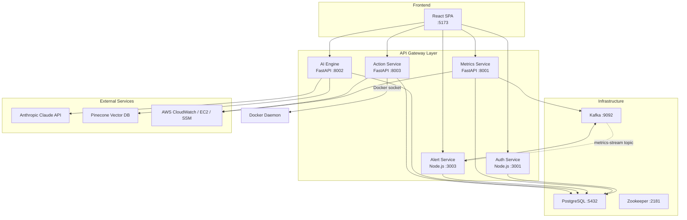
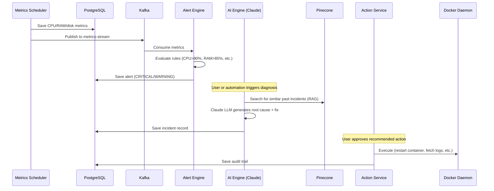
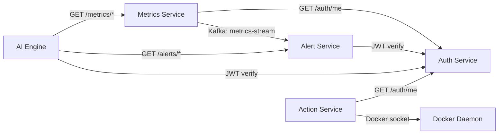

# AI DevOps Copilot — Complete Project Context

> **Purpose**: This document provides exhaustive context about the AI DevOps Copilot project — its architecture, directory structure, every backend endpoint, every frontend API call, and a gap analysis of what's missing.

---

## Table of Contents

1. [Project Overview](#1-project-overview)
2. [Architecture](#2-architecture)
3. [Technology Stack](#3-technology-stack)
4. [Directory Structure](#4-directory-structure)
5. [Service Port Map](#5-service-port-map)
6. [All Backend Endpoints](#6-all-backend-endpoints)
7. [All Frontend API Calls](#7-all-frontend-api-calls)
8. [Gap Analysis — Missing Endpoints](#8-gap-analysis--missing-endpoints)
9. [Frontend Pages Status](#9-frontend-pages-status)
10. [Database Schema](#10-database-schema)
11. [Infrastructure Components](#11-infrastructure-components)
12. [Inter-Service Communication](#12-inter-service-communication)
13. [External Dependencies](#13-external-dependencies)

---

## 1. Project Overview

**AI DevOps Copilot** is a full-stack, microservices-based platform that monitors cloud infrastructure, detects anomalies, and uses AI (Claude LLM + RAG with Pinecone) to diagnose incidents and recommend automated remediation actions.

The project was built in **7 phases**:

| Phase | Component | Description |
|-------|-----------|-------------|
| 1 | **Auth Service** | JWT-based authentication (register, login, me) |
| 2 | **Metrics Service** | CPU/RAM/disk metric collection (local + AWS CloudWatch) |
| 3 | **Alert Service** | Kafka-driven alert engine with threshold-based rules |
| 4 | **AI Engine** | LLM diagnosis via Claude + RAG with Pinecone vector DB |
| 5 | **Multi-Agent Pipeline** | 4-agent orchestrator (Log Analyzer → Metrics Analyzer → Decision → Executor) |
| 6 | **Action Service** | Docker/AWS infrastructure actions with approval workflow + audit trail |
| 7 | **Frontend** | React + Vite dashboard with real-time metrics, alerts, AI chat, actions UI |

---

## 2. Architecture

### High-Level Architecture



### Data Flow: Incident Detection → AI Diagnosis → Automated Fix



---

## 3. Technology Stack

| Layer | Technology |
|-------|-----------|
| **Frontend** | React 19, Vite 8, TailwindCSS 4, Zustand, React Router 6, Recharts, Axios, TanStack Query |
| **Auth Service** | Node.js 20, Express 4, bcrypt, jsonwebtoken, pg, helmet, express-rate-limit |
| **Metrics Service** | Python 3.11, FastAPI, SQLAlchemy (async), asyncpg, APScheduler, boto3, aiokafka, cryptography |
| **Alert Service** | Node.js 20, Express 4, kafkajs, node-cron, pg |
| **AI Engine** | Python 3.11, FastAPI, Anthropic SDK, Pinecone SDK, sentence-transformers, onnxruntime |
| **Action Service** | Python 3.11, FastAPI, SQLAlchemy (async), docker-py, boto3 |
| **Database** | PostgreSQL 16 (Alpine) — 4 databases: authdb, metricsdb, alertsdb, actionsdb |
| **Message Broker** | Apache Kafka 7.5.3 (Confluent) + Zookeeper |
| **Containerization** | Docker Compose v5, multi-service orchestration |
| **Frontend Hosting** | Nginx (Alpine) serving Vite build artifacts |

---

## 4. Directory Structure

```
ai-devops-copilot/
├── .gitignore
├── README.md
├── DIAGNOSIS_REPORT.md              # Initial bug diagnosis
├── DIAGNOSIS_REPORT_V2.md           # Post-fix verification
├── PROJECT_REPORT.txt               # Full project report
├── simulate_cpu.py                  # CPU stress test utility
├── test_phase4.py                   # E2E test: AI Engine (Phase 4)
├── test_out.txt                     # Test output log
│
├── infra/                           # Docker Compose orchestration
│   ├── docker-compose.yml           # All 9+ services defined here
│   ├── .env                         # AWS credentials (gitignored)
│   ├── .env.example                 # Template for .env
│   └── postgres-init/
│       └── init.sql                 # Creates authdb, metricsdb, alertsdb, actionsdb
│
├── frontend/                        # React SPA (Vite + TailwindCSS)
│   ├── Dockerfile                   # Multi-stage: npm build → nginx serve
│   ├── nginx.conf                   # SPA routing config
│   ├── package.json                 # React 19, Vite 8, Recharts, Zustand
│   ├── vite.config.js
│   ├── index.html
│   ├── public/                      # Static assets (logos, icons)
│   └── src/
│       ├── main.jsx                 # App entry point (React Router + QueryClient)
│       ├── App.jsx                  # Route definitions (13 routes)
│       ├── App.css                  # Global styles
│       ├── index.css                # Tailwind directives
│       ├── api/                     # Axios API clients
│       │   ├── client.js            # Base clients for all 5 services
│       │   ├── auth.js              # 16 auth API functions
│       │   ├── metrics.js           # 7 metrics + 4 cloud API functions
│       │   ├── alerts.js            # 2 alert API functions
│       │   ├── ai.js                # 4 AI API functions
│       │   └── actions.js           # 6 action API functions
│       ├── store/
│       │   └── useStore.js          # Zustand global state (auth, UI, alerts)
│       ├── utils/
│       │   └── formatters.js        # Number/date formatting helpers
│       ├── components/
│       │   ├── layout/
│       │   │   ├── AppLayout.jsx    # Sidebar + Header + <Outlet>
│       │   │   ├── Sidebar.jsx      # Navigation (10 items + settings + logout)
│       │   │   └── Header.jsx       # Top bar (dark mode, alerts badge, avatar)
│       │   ├── common/
│       │   │   ├── LoadingSpinner.jsx
│       │   │   └── StatusBadge.jsx
│       │   ├── dashboard/
│       │   │   ├── MetricCard.jsx
│       │   │   ├── StatCard.jsx
│       │   │   ├── StatPills.jsx
│       │   │   ├── CombinedChart.jsx
│       │   │   ├── MetricsChart.jsx
│       │   │   ├── MetricsVisualizationPanel.jsx
│       │   │   ├── ServiceHealthCard.jsx
│       │   │   ├── AISummary.jsx
│       │   │   ├── AITimeline.jsx
│       │   │   ├── CopilotDecisions.jsx
│       │   │   ├── LiveEventStream.jsx
│       │   │   ├── LiveTerminal.jsx
│       │   │   └── charts/
│       │   │       ├── CpuChart.jsx
│       │   │       ├── MemoryChart.jsx
│       │   │       ├── NetworkChart.jsx
│       │   │       └── ServiceHealthGrid.jsx
│       │   ├── alerts/              # Alert-specific components
│       │   ├── actions/             # Action-specific components
│       │   └── chat/                # Chat-specific components
│       └── pages/
│           ├── Login.jsx            # Login + Register (tabbed UI)
│           ├── Dashboard.jsx        # Main dashboard with metrics charts
│           ├── Alerts.jsx           # Alert list with filters + resolve
│           ├── Chat.jsx             # AI chat interface
│           ├── Actions.jsx          # Action list + approve/reject/execute
│           ├── AIInsights.jsx       # AI analysis panel
│           ├── CloudConfiguration.jsx  # AWS onboarding wizard
│           ├── Settings.jsx         # User settings page
│           └── ComingSoon.jsx       # Placeholder for unbuilt pages
│
├── services/
│   ├── auth-service/                # Phase 1 — JWT Authentication
│   │   ├── Dockerfile
│   │   ├── package.json
│   │   └── src/
│   │       ├── index.js             # Express app entry
│   │       ├── config/db.js         # PostgreSQL connection pool
│   │       ├── database/migrations.js  # Creates users table
│   │       ├── controllers/authController.js  # register, login, getMe, health
│   │       ├── middleware/
│   │       │   ├── verifyToken.js   # JWT verification middleware
│   │       │   ├── security.js      # Helmet + security headers
│   │       │   └── rateLimiter.js   # express-rate-limit
│   │       ├── models/User.js       # User CRUD (create, findByEmail, findById)
│   │       ├── routes/auth.js       # Route definitions
│   │       └── observability/       # (empty — placeholder)
│   │
│   ├── metrics-service/             # Phase 2 — Metrics Collection
│   │   ├── Dockerfile
│   │   ├── requirements.txt
│   │   ├── SSM_SETUP.md             # AWS Systems Manager setup guide
│   │   └── src/
│   │       ├── main.py              # FastAPI app + lifespan (scheduler, Kafka)
│   │       ├── config.py            # Pydantic settings (env vars)
│   │       ├── database.py          # SQLAlchemy async engine + session
│   │       ├── models.py            # Metric ORM model
│   │       ├── schemas.py           # Pydantic request/response models
│   │       ├── normalizer.py        # Metric normalization utilities
│   │       ├── crypto.py            # Fernet encryption for cloud credentials
│   │       ├── scheduler.py         # APScheduler (collects every 60s)
│   │       ├── collectors/
│   │       │   ├── local_collector.py   # psutil-based local metrics
│   │       │   └── aws_collector.py     # CloudWatch-based AWS metrics
│   │       ├── kafka/
│   │       │   └── producer.py      # Publishes metrics to Kafka topic
│   │       └── routes/
│   │           ├── metrics.py       # /metrics/* endpoints (7 endpoints)
│   │           └── onboarding.py    # /cloud/* endpoints (4 endpoints)
│   │
│   ├── alert-service/               # Phase 3 — Alerting Engine
│   │   ├── Dockerfile
│   │   ├── package.json
│   │   └── src/
│   │       ├── index.js             # Express app + Kafka consumer + cron
│   │       ├── config/db.js         # PostgreSQL connection
│   │       ├── controllers/alertController.js  # CRUD + summary
│   │       ├── engine/
│   │       │   ├── alertEngine.js   # Threshold evaluator + silent service check
│   │       │   └── rules.js         # Alert rule definitions
│   │       ├── kafka/
│   │       │   └── consumer.js      # Consumes from metrics-stream topic
│   │       ├── middleware/
│   │       │   └── verifyToken.js   # JWT verification
│   │       ├── routes/alerts.js     # Route definitions
│   │       ├── services/
│   │       │   ├── alertService.js  # Alert persistence logic
│   │       │   └── notifier.js      # Notification sender (webhook/email stub)
│   │       └── observability/
│   │           └── logger.js        # Structured logging
│   │
│   ├── ai-engine/                   # Phase 4+5 — AI Diagnosis + Multi-Agent
│   │   ├── Dockerfile
│   │   ├── requirements.txt
│   │   └── src/
│   │       ├── main.py              # FastAPI app + singleton lifecycle
│   │       ├── config.py            # Settings (Claude API key, Pinecone, etc.)
│   │       ├── database.py          # SQLAlchemy async engine
│   │       ├── models.py            # Incident ORM model
│   │       ├── schemas.py           # Pydantic models (diagnose, chat, incident)
│   │       ├── llm/
│   │       │   ├── client.py        # Anthropic Claude SDK wrapper
│   │       │   └── prompts.py       # System/user prompt templates
│   │       ├── rag/
│   │       │   ├── embedder.py      # SentenceTransformer (ONNX backend)
│   │       │   ├── vector_store.py  # Pinecone upsert/query
│   │       │   └── retriever.py     # RAG context retrieval
│   │       ├── agents/              # Phase 5: Multi-agent pipeline
│   │       │   ├── base_agent.py    # Abstract agent interface
│   │       │   ├── log_analyzer_agent.py    # Agent 1: regex/keyword log analysis
│   │       │   ├── metrics_analyzer_agent.py  # Agent 2: statistical metrics analysis
│   │       │   ├── decision_agent.py  # Agent 3: Claude LLM call
│   │       │   ├── executor_agent.py  # Agent 4: action plan builder
│   │       │   └── orchestrator.py  # Runs all 4 agents in sequence
│   │       ├── services/
│   │       │   ├── diagnosis_service.py  # Phase 4 diagnosis flow
│   │       │   └── chat_service.py      # Conversational AI flow
│   │       ├── routes/
│   │       │   ├── diagnose.py      # POST /ai/diagnose
│   │       │   ├── chat.py          # POST /ai/chat
│   │       │   ├── incidents.py     # GET/POST /ai/incidents/*
│   │       │   └── analyze.py       # POST /ai/analyze (Phase 5 pipeline)
│   │       └── observability/
│   │           ├── logger.py
│   │           └── tracing.py
│   │
│   └── action-service/              # Phase 6 — Remediation Actions
│       ├── Dockerfile
│       ├── requirements.txt
│       └── src/
│           ├── main.py              # FastAPI app + Docker connectivity check
│           ├── database.py          # SQLAlchemy async engine
│           ├── models.py            # Action + AuditLog ORM models
│           ├── schemas.py           # Request/response schemas + allowed types
│           ├── approval_gate.py     # Approval workflow (create, approve, reject, expire)
│           ├── audit_logger.py      # Immutable audit trail logger
│           ├── executors/
│           │   ├── base_executor.py     # Abstract executor interface
│           │   ├── docker_executor.py   # Docker ops (restart, stop, logs, stats)
│           │   └── aws_executor.py      # AWS ops (rollback, scale — DRY_RUN mode)
│           ├── middleware/
│           │   └── verify_token.py  # JWT verification via auth-service
│           ├── routes/
│           │   └── actions.py       # All action endpoints (8 endpoints)
│           └── observability/
│               ├── logger.py
│               └── tracing.py
│
├── observability/                   # Monitoring stack configs (placeholders)
│   ├── alertmanager/
│   ├── grafana/provisioning/
│   │   ├── dashboards/sentinel/
│   │   └── datasources/
│   ├── loki/
│   ├── otel/
│   ├── prometheus/rules/
│   ├── promtail/
│   └── tempo/
│
├── test-tools/                      # E2E test scripts
│   ├── test_gemini.py               # Gemini API connectivity test
│   ├── test_payload.json            # Sample test payload
│   ├── test_phase5.py               # Phase 5 multi-agent pipeline tests
│   ├── test_phase6.py               # Phase 6 action service tests
│   └── verify_fixes.py             # Post-fix verification script
│
└── tests/
    └── observability/               # (empty — placeholder)
```

---

## 5. Service Port Map

| Service | Internal Port | External Port | Protocol |
|---------|--------------|---------------|----------|
| **Frontend (Nginx)** | 80 | **5173** | HTTP |
| **Auth Service** | 3001 | **3001** | HTTP |
| **Metrics Service** | 8001 | **8001** | HTTP |
| **Alert Service** | 3003 | **3003** | HTTP |
| **AI Engine** | 8002 | **8002** | HTTP |
| **Action Service** | 8003 | **8003** | HTTP |
| **PostgreSQL** | 5432 | **5432** | TCP |
| **Kafka** | 9092 | **9092** (internal), **29092** (host) | TCP |
| **Zookeeper** | 2181 | — (internal only) | TCP |

---

## 6. All Backend Endpoints

### 6.1 Auth Service (Node.js — port 3001)

| Method | Path | Auth | Description | Status |
|--------|------|------|-------------|--------|
| `POST` | `/auth/register` | ❌ | Register new user (email + password) | ✅ Implemented |
| `POST` | `/auth/login` | ❌ | Login → returns JWT | ✅ Implemented |
| `GET` | `/auth/health` | ❌ | Service health check | ✅ Implemented |
| `GET` | `/auth/me` | ✅ | Get current user from JWT | ✅ Implemented |

**Total: 4 endpoints implemented**

---

### 6.2 Metrics Service (FastAPI — port 8001)

| Method | Path | Auth | Description | Status |
|--------|------|------|-------------|--------|
| `GET` | `/` | ❌ | Root info (service name, version) | ✅ Implemented |
| `GET` | `/metrics/health` | ❌ | Health + scheduler status | ✅ Implemented |
| `GET` | `/metrics/latest` | ✅ | Latest metric per service | ✅ Implemented |
| `GET` | `/metrics/history` | ✅ | Historical metrics (1-24h) | ✅ Implemented |
| `GET` | `/metrics` | ✅ | Alias for /metrics/history | ✅ Implemented |
| `GET` | `/metrics/summary` | ✅ | Aggregated stats for dashboard | ✅ Implemented |
| `GET` | `/metrics/services` | ✅ | Distinct service names | ✅ Implemented |
| `POST` | `/metrics/collect` | ✅ | Manual collection trigger | ✅ Implemented |
| `POST` | `/cloud/connect` | ✅ | AWS onboarding (validate + discover + save) | ✅ Implemented |
| `GET` | `/cloud/status` | ✅ | Cloud connection status | ✅ Implemented |
| `DELETE` | `/cloud/disconnect` | ✅ | Remove cloud credentials | ✅ Implemented |
| `GET` | `/cloud/instances` | ✅ | Live EC2 instances + metrics | ✅ Implemented |

**Total: 12 endpoints implemented**

---

### 6.3 Alert Service (Node.js — port 3003)

| Method | Path | Auth | Description | Status |
|--------|------|------|-------------|--------|
| `GET` | `/alerts/health` | ❌ | Health + Kafka consumer status | ✅ Implemented |
| `GET` | `/alerts/summary` | ✅ | Dashboard badge counts | ✅ Implemented |
| `GET` | `/alerts/:id` | ✅ | Single alert by UUID | ✅ Implemented |
| `POST` | `/alerts/:id/resolve` | ✅ | Mark alert resolved | ✅ Implemented |
| `GET` | `/alerts` | ✅ | List alerts (filtered) | ✅ Implemented |

**Total: 5 endpoints implemented**

---

### 6.4 AI Engine (FastAPI — port 8002)

| Method | Path | Auth | Description | Status |
|--------|------|------|-------------|--------|
| `GET` | `/ai/health` | ❌ | Health (Pinecone + LLM status) | ✅ Implemented |
| `POST` | `/ai/diagnose` | ✅ | Single-shot diagnosis (Phase 4) | ✅ Implemented |
| `POST` | `/ai/chat` | ✅ | Conversational AI endpoint | ✅ Implemented |
| `GET` | `/ai/incidents` | ✅ | List incidents (filtered) | ✅ Implemented |
| `GET` | `/ai/incidents/:id` | ✅ | Single incident detail | ✅ Implemented |
| `POST` | `/ai/incidents/:id/resolve` | ✅ | Resolve + embed into Pinecone (RAG learning) | ✅ Implemented |
| `POST` | `/ai/analyze` | ✅ | Multi-agent pipeline (Phase 5) | ✅ Implemented |

**Total: 7 endpoints implemented**

---

### 6.5 Action Service (FastAPI — port 8003)

| Method | Path | Auth | Description | Status |
|--------|------|------|-------------|--------|
| `GET` | `/` | ❌ | Root info (service name, version) | ✅ Implemented |
| `GET` | `/health` | ❌ | Health (Docker client status) | ✅ Implemented |
| `GET` | `/actions/health` | ✅ | Health (Docker + AWS + pending count) | ✅ Implemented |
| `POST` | `/actions/execute` | ✅ | Request action (immediate or pending approval) | ✅ Implemented |
| `POST` | `/actions/:id/approve` | ✅ | Approve + execute pending action | ✅ Implemented |
| `POST` | `/actions/:id/reject` | ✅ | Reject pending action | ✅ Implemented |
| `GET` | `/actions` | ✅ | List actions (filtered) | ✅ Implemented |
| `GET` | `/actions/:id` | ✅ | Single action + audit trail | ✅ Implemented |
| `GET` | `/actions/:id/logs` | ✅ | Container log content from fetch_container_logs | ✅ Implemented |
| `DELETE` | `/actions/:id` | ✅ | Soft-delete (set status=REJECTED) | ✅ Implemented |

**Total: 10 endpoints implemented**

---

### Backend Endpoint Summary

| Service | Implemented | Total |
|---------|------------|-------|
| Auth Service | 4 | 4 |
| Metrics Service | 12 | 12 |
| Alert Service | 5 | 5 |
| AI Engine | 7 | 7 |
| Action Service | 10 | 10 |
| **TOTAL** | **38** | **38** |

---

## 7. All Frontend API Calls

### 7.1 Auth API (`frontend/src/api/auth.js`) — 16 functions

| Function | HTTP Call | Backend Exists? |
|----------|----------|----------------|
| `loginUser(email, password)` | `POST /auth/login` | ✅ Yes |
| `registerUser(data)` | `POST /auth/register` | ✅ Yes |
| `getMe()` | `GET /auth/me` | ✅ Yes |
| `logoutUser()` | `POST /auth/logout` | ❌ **NO BACKEND** |
| `refreshToken()` | `POST /auth/refresh` | ❌ **NO BACKEND** |
| `getProfile()` | `GET /auth/profile` | ❌ **NO BACKEND** |
| `updateProfile(data)` | `PATCH /auth/profile` | ❌ **NO BACKEND** |
| `changePassword(data)` | `POST /auth/change-password` | ❌ **NO BACKEND** |
| `forgotPassword(email)` | `POST /auth/forgot-password` | ❌ **NO BACKEND** |
| `resetPassword(data)` | `POST /auth/reset-password` | ❌ **NO BACKEND** |
| `setupMFA()` | `POST /auth/mfa/setup` | ❌ **NO BACKEND** |
| `verifyMFASetup(code, token)` | `POST /auth/mfa/verify-setup` | ❌ **NO BACKEND** |
| `validateMFA(data)` | `POST /auth/mfa/validate` | ❌ **NO BACKEND** |
| `disableMFA(password, code)` | `POST /auth/mfa/disable` | ❌ **NO BACKEND** |
| `regenerateBackupCodes(password)` | `POST /auth/mfa/backup-codes` | ❌ **NO BACKEND** |
| `getSessions()` | `GET /auth/sessions` | ❌ **NO BACKEND** |
| `revokeSession(id)` | `DELETE /auth/sessions/:id` | ❌ **NO BACKEND** |
| `revokeAllSessions()` | `DELETE /auth/sessions/all` | ❌ **NO BACKEND** |
| `getAuditLog(params)` | `GET /auth/audit-log` | ❌ **NO BACKEND** |

### 7.2 Metrics API (`frontend/src/api/metrics.js`) — 11 functions

| Function | HTTP Call | Backend Exists? |
|----------|----------|----------------|
| `getLatestMetrics()` | `GET /metrics/latest` | ✅ Yes |
| `getMetricsHistory(params)` | `GET /metrics/history` | ✅ Yes |
| `getMetricsSummary()` | `GET /metrics/summary` | ✅ Yes |
| `getServices(userId)` | `GET /metrics/services` | ✅ Yes |
| `triggerCollection()` | `POST /metrics/collect` | ✅ Yes |
| `connectCloud(data)` | `POST /cloud/connect` | ✅ Yes |
| `getCloudStatus()` | `GET /cloud/status` | ✅ Yes |
| `disconnectCloud(data)` | `DELETE /cloud/disconnect` | ✅ Yes |
| `getCloudInstances()` | `GET /cloud/instances` | ✅ Yes |

### 7.3 Alerts API (`frontend/src/api/alerts.js`) — 2 functions

| Function | HTTP Call | Backend Exists? |
|----------|----------|----------------|
| `getAlerts(params)` | `GET /alerts` | ✅ Yes |
| `resolveAlert(alertId)` | `POST /alerts/:id/resolve` | ✅ Yes |

### 7.4 AI API (`frontend/src/api/ai.js`) — 4 functions

| Function | HTTP Call | Backend Exists? |
|----------|----------|----------------|
| `analyzeIncident(data)` | `POST /ai/analyze` | ✅ Yes |
| `chatWithAI(data)` | `POST /ai/chat` | ✅ Yes |
| `getIncidents()` | `GET /ai/incidents` | ✅ Yes |
| `getAIHealth()` | `GET /ai/health` | ✅ Yes |

### 7.5 Actions API (`frontend/src/api/actions.js`) — 6 functions

| Function | HTTP Call | Backend Exists? |
|----------|----------|----------------|
| `executeAction(data)` | `POST /actions/execute` | ✅ Yes |
| `approveAction(actionId)` | `POST /actions/:id/approve` | ✅ Yes |
| `rejectAction(actionId, reason)` | `POST /actions/:id/reject` | ✅ Yes |
| `getActions(params)` | `GET /actions` | ✅ Yes |
| `getAction(actionId)` | `GET /actions/:id` | ✅ Yes |
| `getActionsHealth()` | `GET /actions/health` | ✅ Yes |

---

## 8. Gap Analysis — Missing Endpoints

### 8.1 Frontend calls with NO backend implementation

> [!CAUTION]
> **17 frontend API calls** hit endpoints that **do not exist** in the backend. These will return 404 errors.

| # | Frontend Call | Expected Backend Path | Service | Category |
|---|-------------|----------------------|---------|----------|
| 1 | `logoutUser()` | `POST /auth/logout` | auth-service | Session mgmt |
| 2 | `refreshToken()` | `POST /auth/refresh` | auth-service | Token refresh |
| 3 | `getProfile()` | `GET /auth/profile` | auth-service | Profile |
| 4 | `updateProfile()` | `PATCH /auth/profile` | auth-service | Profile |
| 5 | `changePassword()` | `POST /auth/change-password` | auth-service | Password |
| 6 | `forgotPassword()` | `POST /auth/forgot-password` | auth-service | Password reset |
| 7 | `resetPassword()` | `POST /auth/reset-password` | auth-service | Password reset |
| 8 | `setupMFA()` | `POST /auth/mfa/setup` | auth-service | MFA |
| 9 | `verifyMFASetup()` | `POST /auth/mfa/verify-setup` | auth-service | MFA |
| 10 | `validateMFA()` | `POST /auth/mfa/validate` | auth-service | MFA |
| 11 | `disableMFA()` | `POST /auth/mfa/disable` | auth-service | MFA |
| 12 | `regenerateBackupCodes()` | `POST /auth/mfa/backup-codes` | auth-service | MFA |
| 13 | `getSessions()` | `GET /auth/sessions` | auth-service | Sessions |
| 14 | `revokeSession()` | `DELETE /auth/sessions/:id` | auth-service | Sessions |
| 15 | `revokeAllSessions()` | `DELETE /auth/sessions/all` | auth-service | Sessions |
| 16 | `getAuditLog()` | `GET /auth/audit-log` | auth-service | Audit |

### 8.2 Missing endpoints grouped by feature

| Feature | Missing Endpoints | Count |
|---------|------------------|-------|
| **Auth Session Management** | logout, refresh, sessions CRUD | 4 |
| **User Profile** | get profile, update profile, change password | 3 |
| **Password Reset** | forgot password, reset password | 2 |
| **MFA (2FA)** | setup, verify-setup, validate, disable, backup-codes | 5 |
| **Audit Logging** | get audit log | 1 |
| **TOTAL** | | **15** |

> [!NOTE]
> All 15 missing endpoints are in the **auth-service** only. The other 4 services (metrics, alerts, AI, actions) have **complete backend coverage** for every frontend call.

### 8.3 Backend endpoints with NO frontend consumer

| Backend Endpoint | Service | Notes |
|-----------------|---------|-------|
| `GET /alerts/summary` | alert-service | Implemented but not called from frontend API layer |
| `GET /alerts/:id` | alert-service | Implemented but not called from frontend API layer |
| `POST /ai/diagnose` | ai-engine | Phase 4 endpoint — frontend uses Phase 5 `/ai/analyze` instead |
| `POST /ai/incidents/:id/resolve` | ai-engine | Implemented but no frontend UI to resolve incidents |
| `GET /actions/:id/logs` | action-service | Implemented but no frontend UI to view fetched logs |
| `DELETE /actions/:id` | action-service | Implemented but no frontend delete button |

---

## 9. Frontend Pages Status

| Route | Page Component | Status | Notes |
|-------|---------------|--------|-------|
| `/login` | `Login.jsx` | ✅ **Working** | Login + register with tabbed UI |
| `/dashboard` | `Dashboard.jsx` | ✅ **Working** | Metrics charts, stat cards, service health |
| `/alerts` | `Alerts.jsx` | ✅ **Working** | Alert list, severity filters, resolve action |
| `/insights` | `AIInsights.jsx` | ✅ **Working** | AI analysis trigger + results |
| `/chat` | `Chat.jsx` | ✅ **Working** | Conversational AI interface |
| `/actions` | `Actions.jsx` | ✅ **Working** | Action list, approve/reject workflow |
| `/cloud-configuration` | `CloudConfiguration.jsx` | ✅ **Working** | AWS credential wizard + instance discovery |
| `/settings` | `Settings.jsx` | ✅ **Working** | User settings (calls missing auth endpoints) |
| `/clusters` | `ComingSoon.jsx` | 🔜 **Coming Soon** | Infrastructure management |
| `/metrics` | `ComingSoon.jsx` | 🔜 **Coming Soon** | Detailed metrics explorer |
| `/logs` | `ComingSoon.jsx` | 🔜 **Coming Soon** | Log explorer / search |
| `/multi-cloud` | `ComingSoon.jsx` | 🔜 **Coming Soon** | Multi-cloud management |
| `/cost` | `ComingSoon.jsx` | 🔜 **Coming Soon** | Cost optimization |

---

## 10. Database Schema

### PostgreSQL Databases (4 total)

#### `authdb` — Auth Service + AI Engine

```sql
-- Auth Service
CREATE TABLE users (
    id            UUID PRIMARY KEY DEFAULT gen_random_uuid(),
    email         VARCHAR(255) UNIQUE NOT NULL,
    password_hash TEXT NOT NULL,
    created_at    TIMESTAMP WITH TIME ZONE DEFAULT NOW()
);

-- AI Engine
CREATE TABLE incidents (
    id                UUID PRIMARY KEY,
    user_id           UUID NOT NULL,
    service_name      VARCHAR(255),
    alert_id          UUID,
    alert_type        VARCHAR(50),
    severity          VARCHAR(20),
    cpu_percent       FLOAT,
    ram_percent       FLOAT,
    disk_percent      FLOAT,
    log_excerpt       TEXT,
    root_cause        TEXT,
    simple_explanation TEXT,
    fix_steps         TEXT,  -- JSON array
    resolution        TEXT,
    status            VARCHAR(20),  -- open, resolved
    confidence        FLOAT,
    ai_response       TEXT,  -- full JSON
    created_at        TIMESTAMP,
    resolved_at       TIMESTAMP
);
```

#### `metricsdb` — Metrics Service

```sql
CREATE TABLE metrics (
    id            UUID PRIMARY KEY,
    user_id       UUID NOT NULL,
    service_name  VARCHAR(255),
    source        VARCHAR(20),  -- "local" or "aws"
    cpu_percent   FLOAT,
    ram_percent   FLOAT,
    disk_percent  FLOAT,
    net_bytes_sent   BIGINT,
    net_bytes_recv   BIGINT,
    timestamp     TIMESTAMP
);

CREATE TABLE cloud_credentials (
    id                    UUID PRIMARY KEY,
    user_id               UUID NOT NULL,
    provider              VARCHAR(20),
    region                VARCHAR(50),
    access_key_encrypted  TEXT,
    secret_key_encrypted  TEXT,
    account_id            VARCHAR(50),
    status                VARCHAR(20),
    instances_found       INTEGER,
    connected_at          TIMESTAMP,
    last_sync_at          TIMESTAMP
);
```

#### `alertsdb` — Alert Service

```sql
CREATE TABLE alerts (
    id             UUID PRIMARY KEY,
    user_id        UUID,
    service_name   VARCHAR(255),
    alert_type     VARCHAR(50),
    severity       VARCHAR(20),  -- CRITICAL, WARNING, INFO
    message        TEXT,
    metric_value   FLOAT,
    threshold      FLOAT,
    status         VARCHAR(20),  -- open, resolved
    resolved_at    TIMESTAMP,
    created_at     TIMESTAMP DEFAULT NOW()
);
```

#### `actionsdb` — Action Service

```sql
CREATE TABLE actions (
    id                UUID PRIMARY KEY,
    user_id           UUID NOT NULL,
    action_type       VARCHAR(50),
    target_service    VARCHAR(255),
    executor_type     VARCHAR(20),  -- docker, aws
    params            JSONB,
    status            VARCHAR(30),  -- PENDING_APPROVAL, APPROVED, EXECUTING, COMPLETED, FAILED, REJECTED
    risk_level        VARCHAR(10),  -- LOW, MEDIUM, HIGH, CRITICAL
    requires_approval BOOLEAN DEFAULT TRUE,
    approved_by       UUID,
    approved_at       TIMESTAMP,
    executed_at       TIMESTAMP,
    completed_at      TIMESTAMP,
    result            JSONB,
    error_message     TEXT,
    incident_id       UUID,
    created_at        TIMESTAMP DEFAULT NOW()
);

CREATE TABLE audit_logs (
    id           UUID PRIMARY KEY,
    action_id    UUID REFERENCES actions(id),
    user_id      UUID NOT NULL,
    event_type   VARCHAR(50),
    event_detail TEXT,
    ip_address   VARCHAR(45),
    timestamp    TIMESTAMP DEFAULT NOW()
);
```

---

## 11. Infrastructure Components

### Kafka

- **Broker**: Confluent CP-Kafka 7.5.3
- **Topic**: `metrics-stream` (1 partition, replication factor 1)
- **Producer**: metrics-service publishes every metric reading
- **Consumer**: alert-service consumes and evaluates alert rules
- **Zookeeper**: Required for Kafka coordination (port 2181)

### Docker Compose Services (9 containers)

| Container | Image | Dependency Chain |
|-----------|-------|-----------------|
| `postgres` | postgres:16-alpine | — (root) |
| `zookeeper` | confluentinc/cp-zookeeper:7.5.3 | — (root) |
| `kafka` | confluentinc/cp-kafka:7.5.3 | zookeeper (healthy) |
| `kafka-init` | confluentinc/cp-kafka:7.5.3 | kafka (healthy) — one-shot topic creator |
| `auth-service` | build: ../services/auth-service | postgres (healthy) |
| `metrics-service` | build: ../services/metrics-service | postgres, auth-service, kafka |
| `alert-service` | build: ../services/alert-service | postgres, kafka, metrics-service |
| `ai-engine` | build: ../services/ai-engine | postgres, metrics-service, alert-service |
| `action-service` | build: ../services/action-service | postgres, auth-service, ai-engine |
| `frontend` | build: ../frontend | all services |

---

## 12. Inter-Service Communication



**Authentication pattern**: All services verify JWTs by calling `GET /auth/me` on the auth-service (proxy-based verification, not local JWT decode). This means the auth-service must be running for any authenticated request to succeed.

---

## 13. External Dependencies

| Service | External API | Purpose | Required? |
|---------|-------------|---------|-----------|
| AI Engine | **Anthropic Claude API** | LLM for diagnosis + chat | ✅ For AI features |
| AI Engine | **Pinecone** | Vector DB for RAG (incident learning) | ✅ For RAG features |
| Metrics Service | **AWS CloudWatch** | Cloud metric collection | ⚠️ Optional (local metrics work without) |
| Metrics Service | **AWS STS** | Credential validation during onboarding | ⚠️ Optional |
| Metrics Service | **AWS EC2** | Instance discovery | ⚠️ Optional |
| Metrics Service | **AWS SSM** | Agent installation on EC2 | ⚠️ Optional |
| Action Service | **AWS EC2/ASG** | Cloud remediation actions | ⚠️ Optional (DRY_RUN mode) |

### Required Environment Variables

```bash
# AI Engine (.env)
ANTHROPIC_API_KEY=sk-ant-...        # Claude API key
PINECONE_API_KEY=...                # Pinecone API key
PINECONE_INDEX_NAME=devops-incidents

# Metrics Service / Action Service (infra/.env)
AWS_ACCESS_KEY_ID=AKIA...
AWS_SECRET_ACCESS_KEY=...
AWS_DEFAULT_REGION=ap-south-1

# Shared
JWT_SECRET=14856ac8af742b72...      # Same across all services
ENCRYPTION_KEY=...                  # Fernet key for credential encryption
```

---

> [!IMPORTANT]
> **Summary**: 38 backend endpoints are fully implemented across 5 services. 15 auth-related frontend API calls (profile, MFA, sessions, audit) have **no backend implementation** yet. 5 frontend pages (Infrastructure, Metrics, Logs, Multi-Cloud, Cost) are **Coming Soon** placeholders.
